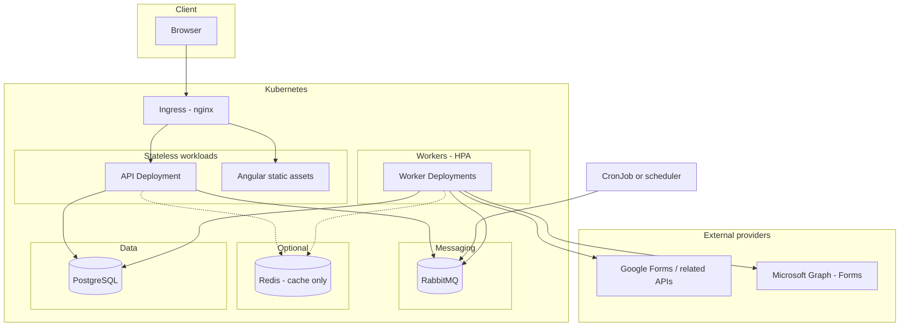

# Survey Service — System Architecture

This document describes the target architecture for an internal tool that ingests form/survey data from **Google Forms** and **Microsoft Forms**, stores and analyzes it, and exposes results through a **modern Angular** frontend.

**Scope:** single organization, &lt;500 users, single primary database, horizontally scalable workers.

---

## 1. Goals

- Ingest responses via official provider APIs (authorized clients; not scraping).
- Persist raw and normalized data for audit and re-processing.
- Run analysis (aggregations first; richer analytics later).
- Present dashboards and exports in Angular.
- Enforce **per-user data ownership** with **optional sharing** to other users.

---

## 2. Context and constraints

| Requirement | Implication |
|-------------|-------------|
| Single organization | One deployment boundary; shared IdP; internal tooling. |
| User-owned data | Every ingested resource has an **owner user id**; default access is owner-only. |
| Optional sharing | Explicit grants or visibility rules (e.g. shared with user/group, or org-wide read where policy allows). Enforce in **API** and **database** (application layer and/or PostgreSQL RLS). |
| Patch-style sync + manual sync | **Scheduled incremental** syncs plus **user-initiated** sync jobs (enqueue only; no heavy work in HTTP). |
| Single database | One **PostgreSQL** instance is sufficient at current scale; focus on indexes, pooling, and short transactions. |
| Scale workers horizontally | **Stateless workers** + **RabbitMQ** + idempotent processing. |
| Messaging | **RabbitMQ** for all job queues. **Redis** only if a separate need arises (e.g. caching, rate-limit counters)—not for job durability. |
| Deployment target | **Kubernetes** with **NGINX Ingress** for north-south HTTP/S. |

---

## 3. High-level platform view

- **Ingress (nginx):** TLS termination, routing (e.g. `api.*` vs app host, or path-based `/api`), timeouts and upload limits tuned per route.
- **API:** Validates auth, ownership, and sharing; enqueues work to RabbitMQ; does not run long syncs inline.
- **Workers:** Consume RabbitMQ messages; call providers; write PostgreSQL; scale with **Deployment replicas** and **HPA**.
- **Scheduler:** Kubernetes **CronJob** (or a lightweight in-cluster process) publishes the same job types as manual sync on a cadence.

---

## 4. Logical components

| Component | Role |
|-----------|------|
| **Angular SPA** | Dashboards, connection management, sync status, filters, charts, exports. Talks only to the **API**. |
| **API / BFF** | REST (or GraphQL); authz for owner + shares; enqueue sync/analysis jobs; optional transactional **outbox** to RabbitMQ for reliable publish-after-commit. |
| **Auth** | Organization IdP (OIDC/SAML, etc.); map identity to application `users`. |
| **Connector: Google** | Google Forms / Sheets / Drive APIs as required by the form setup; OAuth or service accounts per organizational policy. |
| **Connector: Microsoft** | Microsoft Graph Forms endpoints; app registration and appropriate permissions. |
| **RabbitMQ** | Durable work queues: sync jobs, analysis jobs, dead-letter handling. |
| **Workers** | Stateless; competing consumers; prefetch and idempotency for at-least-once delivery. |
| **PostgreSQL** | Canonical model, aggregates, optional raw payload storage or references. |
| **Redis (optional)** | Cache for expensive dashboard queries, session offload, or rate limiting—not a message bus. |

---

## 5. Data ownership and sharing (conceptual model)

- **`users`** — tied to org identity.
- **Owned resources** — forms, connections, saved views: include **`owner_user_id`**.
- **Sharing** — `resource_shares` or equivalent: `(resource, grantee, permission)` or visibility enums (`private`, `shared_users`, `organization`).

**Rule:** list/detail and reporting endpoints always apply `(owner = current user) OR (shared with me) OR (policy allows)` consistently (service layer and optionally **RLS**).

---

## 6. Synchronization model

| Mode | Behavior |
|------|----------|
| **Scheduled incremental** | Workers fetch **new/changed** responses since last watermark per `(connection, external_form_id)`. Persist cursors (`last_sync_at`, provider cursor, max external id). |
| **User-initiated** | API validates access → **publish message** → **202 Accepted** + `job_id`. Same worker code path; headers/payload indicate `trigger: manual` and optional `force_full`. |
| **Idempotency** | Natural keys `(provider, external_response_id)` (or hash) to avoid duplicates under retry and overlapping jobs. |
| **Fairness** | Per-user or per-connection concurrency limits so one user cannot starve others when workers scale up. |

---

## 7. RabbitMQ design

| Concern | Approach |
|---------|----------|
| Routing | **Topic** or **direct** exchanges (e.g. `sync.connection`, `sync.form`, `analysis.rollup`). |
| Reliability | Persistent queues and messages; **publisher confirms**; **consumer ack** after successful DB commit. |
| Failures | **Dead-letter exchange (DLX)** and DLQ; operational replay or discard policies. |
| Horizontal scale | **Competing consumers** on shared queues; increase worker **Pod** count for throughput. |
| Back-pressure | **Prefetch (`basic.qos`)** per consumer; optional queue **max-length** / **TTL** policies. |

Redis is **not** used to duplicate this pipeline unless a distinct caching or rate-limiting feature requires it.

---

## 8. Analysis pipeline

- **Phase 1:** SQL/materialized views/scheduled rollups (counts, distributions, time series) — messages on RabbitMQ, workers write aggregates to PostgreSQL.
- **Phase 2:** Heavier stats or ML in separate worker types or external tools; same broker pattern.

---

## 9. Kubernetes deployment notes

| Piece | Typical shape |
|-------|----------------|
| **API** | `Deployment` + `Service` (ClusterIP); exposed via **Ingress**. |
| **Angular** | Static `dist/` served by nginx `Deployment` or external CDN; routing via same Ingress host/path strategy. |
| **Workers** | `Deployment`(s) with **HPA** (CPU/memory; later queue-depth via **KEDA** + Prometheus if needed). |
| **CronJob** | Publishes scheduled sync messages to RabbitMQ. |
| **RabbitMQ** | **StatefulSet** or **RabbitMQ Cluster Operator**; **persistent volumes**; single node for non-HA dev, **quorum cluster** for production HA. |
| **PostgreSQL** | Managed database outside the cluster is often simplest initially; connection strings via **Secrets**; **PgBouncer** if worker count grows. |
| **Redis** | Optional `Deployment` or managed cache when a concrete caching or rate-limit requirement exists. |

**Ingress:** Prefer explicit routes for API vs static assets; configure **WebSocket** annotations if live job status is added; increase **proxy read timeouts** only where truly needed—prefer **async export** (job + download URL) for long operations.

---

## 10. Security (summary)

- No secrets in the Angular bundle; OAuth client secrets and refresh tokens stored securely (Secrets manager / encrypted DB).
- Least-privilege provider registrations per environment.
- Define retention and deletion for PII (GDPR-style) early; affects raw store and exports.
- Audit sensitive actions (e.g. share grants, export).

---

## 11. Scaling outlook

- **Workers:** Increase replicas; RabbitMQ distributes load.
- **API:** Scale HTTP replicas independently.
- **PostgreSQL:** Vertical scaling and connection pooling before sharding; single instance remains adequate for current user counts.
- **RabbitMQ:** Scale cluster resources and monitoring before message backlog becomes chronic.

---

## 12. Open decisions (product/ops)

1. Sharing UX: directory lookup vs email invite (affects grantee resolution).
2. Manual sync feedback: polling `GET /jobs/:id` vs WebSocket/SSE.
3. Hosting: managed PostgreSQL and managed RabbitMQ vs self-operated in-cluster.
4. Exact Google/Microsoft OAuth models (delegated vs application permissions) per connector design.

---

## Document history

- Initial architecture: ingestion, PostgreSQL, analysis, Angular.
- Revised: single org, per-user ownership, sharing, hybrid sync, single DB, horizontal workers.
- Revised: RabbitMQ-only messaging; optional Redis for cache; Kubernetes and NGINX Ingress as deployment baseline.
