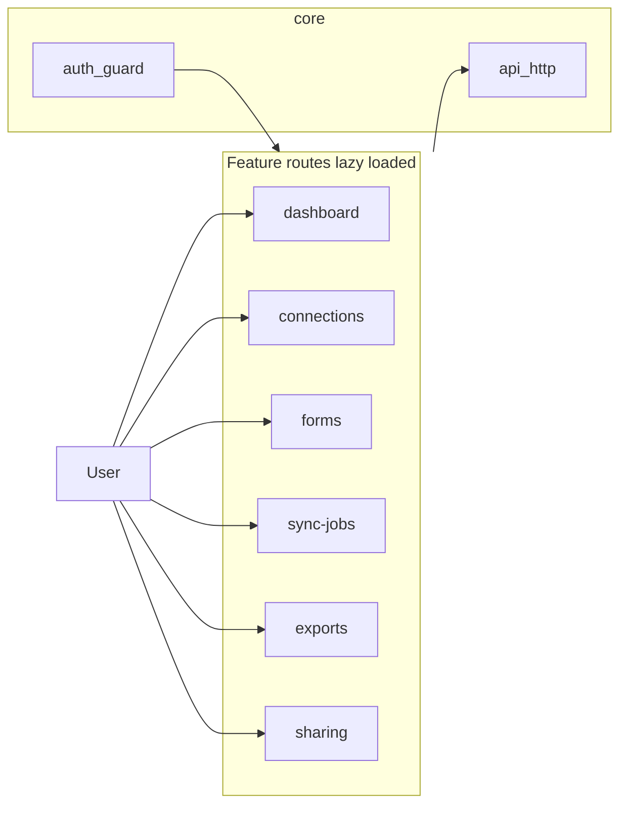
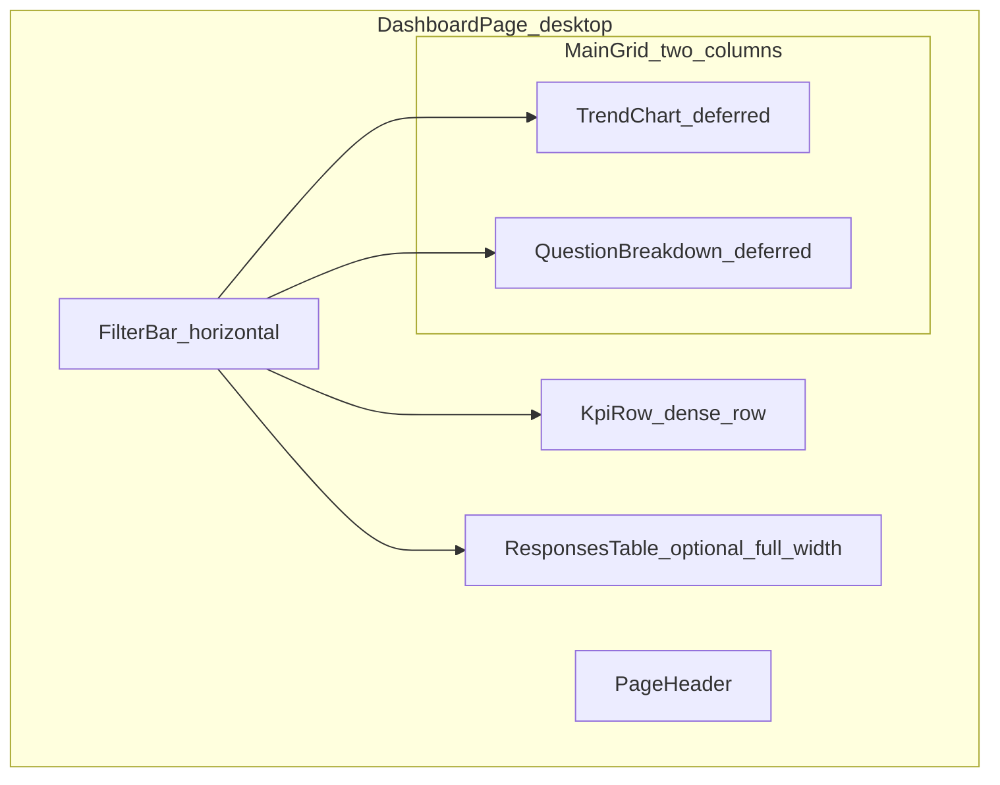

> **Repository copy** — kept under version control for long-term reference. When the plan changes in Cursor (`.cursor/plans/`), update this file to match.

# Angular frontend: design, structure, and features

## Context

- **Product scope** (from [docs/architecture.md](../architecture.md)): internal SPA that talks **only to the API** — dashboards, connection management, sync status, filters, charts, exports; auth via org IdP; **per-resource ownership** with **optional sharing**.
- **Repo layout** (from [docs/repository-structure.md](../repository-structure.md)): Angular lives at **`apps/web`** in a monorepo; environment config for API base URL; optional generated client/types from `packages/contracts`.
- **Angular app exists in `apps/web`** and is partially implemented; this plan tracks alignment work to reach the contract-compliant target architecture from [skills/frontend-patterns/SKILL.md](../../skills/frontend-patterns/SKILL.md).

## Design principles (non-negotiables from skill + architecture)

| Area | Choice |
|------|--------|
| Components | `standalone: true`; `imports` per component |
| Reactivity | `signal` / `computed`; avoid `BehaviorSubject` + `async` for new UI state |
| HTTP reads | `httpResource()` for declarative GET/list/detail tied to signal inputs |
| Mutations | `HttpClient` (POST/PUT/PATCH/DELETE, fire-and-forget or explicit subscribe) — per skill |
| DI | `inject()` instead of constructor injection |
| Inputs/outputs | `input()` / `output()` / `model()` |
| Templates | `@if` / `@for` / `@switch` with `track`; templates kept small — extract child components |
| Change detection | `ChangeDetectionStrategy.OnPush` on components |
| Routing | Lazy routes via `loadComponent` / `loadChildren` with **functional** `canActivate` |
| Secrets | **No secrets in the bundle** — only public OIDC client ids / API base URLs in env ([architecture security summary](../architecture.md)) |

**Web rules** ([rules/web/patterns.md](../../rules/web/patterns.md)): treat **server state** (lists, job status) as authoritative; use **URL state** for shareable filters, sort, pagination, and tabs where product allows.

**API alignment** ([skills/api-design/SKILL.md](../../skills/api-design/SKILL.md)): consume a consistent envelope (e.g. success/data/errors) if the API uses it; map 401/403 to auth UX, handle pagination query params consistently.

---

## Recommended folder structure (`apps/web/src/app`)

Aligned with the skill’s **core / shared / features** split and extended for this domain:

```text
apps/web/src/app/
├── core/                          # App-wide singletons
│   ├── auth/                      # Session facade, OIDC callback handling, authGuard
│   ├── api/                       # API base URL, optional OpenAPI-generated client wrapper
│   └── http/                      # interceptors: Bearer token, error mapping, loading (if not using httpResource-only)
├── layout/                        # Shell: main nav, sidenav, outlet (optional feature-less folder)
├── shared/                        # Dumb/reusable UI + utilities
│   ├── ui/                        # Buttons, page headers, empty states, skeletons
│   ├── pipes/                     # e.g. date/format (standalone pipes)
│   └── directives/                # If needed (a11y, click-outside)
├── features/
│   ├── dashboard/                 # Aggregates, charts, filters (defer heavy charts with @defer)
│   ├── connections/             # Google/Microsoft connection list + create/edit flows
│   ├── forms/                     # Owned/shared forms list, detail, link to provider
│   ├── sync-jobs/                 # Trigger manual sync (202 + job id), job detail / history
│   ├── exports/                 # Request export, poll or redirect to download when ready
│   └── sharing/                   # Grants per resource (UX pending product: directory vs email)
├── app.config.ts                  # provideRouter, provideHttpClient, interceptors, APP_INITIALIZER if needed
├── app.routes.ts                  # Top-level routes + lazy feature routes
└── app.component.ts
```

**Optional monorepo integration:** import **DTO types** from `packages/contracts` (or a thin `api-client` package) so the UI stays aligned with the API and workers — [repository-structure.md](../repository-structure.md) calls this out explicitly.

---

## Feature map (product → routes / responsibilities)

Derived from [docs/architecture.md](../architecture.md) sections 4, 5, and 12.



| Feature | User goals | Angular notes |
|---------|------------|----------------|
| **Dashboard** | See rollups, time series, distributions | Summary here; full IA, URL model, widgets, and file layout in **Dashboard — detailed design** below |
| **Connections** | Add/edit/revoke Google/Microsoft connections | Forms: `ReactiveFormsModule` + typed `FormGroup`; mutations via `HttpClient`; clear empty/error states |
| **Forms** | List owned + shared forms; open detail | List with pagination (`httpResource` + page signal); detail route param → signal → `httpResource` (pattern in skill) |
| **Sync jobs** | Start manual sync; see status | POST → 202 + `job_id`; **poll** `GET /jobs/:id` until terminal state (architecture open decision); later optional WebSocket/SSE swap behind a small `JobStatusPort` abstraction |
| **Exports** | Request CSV/Excel; download when ready | Async job pattern same as sync or dedicated export endpoints; avoid long HTTP waits in UI |
| **Sharing** | Grant/revoke access to a resource | Driven by API contract; UI depends on product choice (directory lookup vs email) — keep **resource-scoped** routes e.g. `forms/:id/sharing` |

**Auth shell:** unauthenticated routes (login/callback) vs authenticated layout (`canActivate: [authGuard]`) using functional guard pattern from [skills/frontend-patterns/SKILL.md](../../skills/frontend-patterns/SKILL.md).

---

## Dashboard — detailed design

This section **extends** the dashboard row in the feature table above without replacing the rest of the frontend plan. It aligns with [docs/architecture.md](../architecture.md) (analysis phase 1: SQL rollups, counts, distributions, time series) and [skills/frontend-patterns/SKILL.md](../../skills/frontend-patterns/SKILL.md) (`httpResource`, signals, `@defer`, URL as state per [rules/web/patterns.md](../../rules/web/patterns.md)).

### Goals and scope

- **Primary purpose:** give analysts a **single place** to see **volume over time**, **high-level KPIs**, and **question-level distributions** for a selected survey/form (and only data the user owns or has been shared — enforced by API).
- **Out of scope for v1 UI (unless API ships it):** ML insights, raw PII-heavy text dumps, real-time streaming updates (prefer refresh + optional polling cadence tied to job/sync status elsewhere).
- **Relationship to other features:** “Export” and “Manual sync” stay separate routes; the dashboard offers **shortcuts** (e.g. “Export this range”, “Last sync status”) that navigate or open dialogs without duplicating full flows.
- **Primary viewport:** **Desktop-first** — layout, density, and information hierarchy assume a **wide screen** (typical analyst workflow: keyboard + mouse, multiple panels visible). Narrow viewports or touch are **out of scope for v1** beyond basic usability (no dedicated mobile layout or thumb-target optimization).

### Information architecture (page regions)

**Layout target:** a **fixed or max-width content canvas** (e.g. 1280–1440px usable width) with **CSS Grid**: header and filter bar **span full width**; main analysis uses **two columns** on desktop (trend + question breakdown side by side); optional table **full width** below. Vertical scrolling is expected for long question lists; avoid hiding primary filters behind hamburger menus—use a **horizontal filter toolbar**.

1. **Page header** — Title (“Dashboard”), optional subtitle (selected form name). **Primary actions:** Refresh (calls `reload()` on relevant `httpResource`s), **Export** (deep-link to exports flow with query params pre-filled when possible).
2. **Filter bar** — **Always visible** horizontal strip (form select, date range, granularity, optional Apply). Drives **all** widgets. Must be **shareable via URL** so users can bookmark or paste a view. Sticky below the app shell header on scroll if the page is long.
3. **KPI row** — 3–6 **compact metric tiles** in a **single dense row** (total responses in range, delta vs previous period, completion rate if available, average time if available). Prefer **equal-width columns** in the grid; no primary “stacked card” layout for this row.
4. **Primary chart zone (left / main column)** — **Responses over time** (line or stacked area by status if API provides series breakdown). This is the **hero** visualization; give it the larger share of width (e.g. 2/3) when paired with a sidebar.
5. **Secondary analytics (right column)** — **Per-question summaries**: e.g. horizontal bar for single-select, histogram for numeric, “top terms” only if product allows (watch PII). Scrollable column if many questions.
6. **Detail table (optional, full width below)** — Recent responses or aggregated breakdown with **server-driven pagination** and sort. Keeps parity with “drill down” without building a second app.

**Responsive note (non-goals):** Do **not** optimize the dashboard for phone-first breakpoints. At best, allow horizontal scroll or simplified single-column **fallback** for narrow windows without redesigning the desktop experience.



### URL state and filter model

**Rule:** anything needed to **reproduce the view** should live in the **query string** ([rules/web/patterns.md](../../rules/web/patterns.md)).

Suggested query keys (names follow API; adjust to generated contract):

| Query param | Role |
|-------------|------|
| `formId` | Required for a meaningful dashboard; empty → empty state prompting selection |
| `from` / `to` | ISO date or epoch; inclusive range |
| `granularity` | `day` \| `week` \| `month` (must match API) |
| `questionId` | Optional: scroll/focus a specific question block |

**Angular wiring:**

- Parse with `ActivatedRoute` → `toSignal(route.queryParamMap, …)` → **computed** `DashboardFilters` object (validated: end ≥ start, max range if product requires).
- **Updating filters:** `Router.navigate` with `queryParamsHandling: 'merge'` from the filter bar; avoid duplicating state in a separate BehaviorSubject unless you need optimistic UI before navigation.
- Optional: **`withComponentInputBinding()`** if the page component exposes route params as `input()` — use only where it reduces boilerplate; keep a single source of truth.

### Data loading (`httpResource` strategy)

- **Prefer few round-trips:** if the API offers `GET .../forms/:id/dashboard?from&to&granularity` returning KPIs + series + question summaries in **one payload**, use **one** `httpResource` keyed off filter signals. This matches “server state is authoritative” and reduces inconsistent loading states.
- **If the API splits endpoints** (e.g. `/kpis`, `/series`, `/questions/:id`): use **multiple** `httpResource` instances — one per widget group — so partial failure still renders other sections (see below).
- **Reload:** wire header “Refresh” to `reload()` on each resource (or a small `DashboardDataFacade` that holds references and calls `reload()` in parallel).
- **Caching:** rely on HTTP cache headers from API if present; do not build a second client-side cache layer until a measured need ([rules/web/patterns.md](../../rules/web/patterns.md) stale-while-revalidate is API/CDN concern first).

### Folder and component breakdown (`features/dashboard/`)

Keep the **page thin**; **dumb** presentational components for each widget; **signals in = DOM out**.

```text
features/dashboard/
├── dashboard.routes.ts                 # path: '' or 'dashboard', canActivate, loadComponent
├── pages/
│   └── dashboard-page.component.ts     # desktop CSS Grid (filter strip, KPI row, 2-col main, full-width table); filter→URL sync
├── components/
│   ├── dashboard-filter-bar/           # form select, date range, granularity, Apply if needed
│   ├── dashboard-kpi-row/
│   │   └── kpi-tile/                   # input: label, value, delta, loading, error
│   ├── responses-trend-chart/          # @defer boundary; lazy-import chart lib inside
│   ├── question-summary-card/            # one question block; @for (question of …; track id)
│   └── responses-breakdown-table/        # optional; pagination outputs to URL (?page, ?sort)
└── data/
    └── dashboard-filters.ts              # pure types + helpers: buildQueryParams, parseQueryParams
```

**Naming:** match [Angular style guide](https://angular.dev/style-guide) — `dashboard-page.component.ts`, selectors `app-dashboard-page`, etc.

### Per-widget UX states

Every block follows the same pattern for predictability:

| State | Behavior |
|-------|------------|
| **Loading** | Skeletons for KPIs/charts; avoid layout shift by fixed min-heights |
| **Error** | Inline `alert` or `shared/ui` error banner with **Retry** (calls `reload()` on that resource only) |
| **Empty (no form)** | Illustration + CTA “Choose a form” / link to **Forms** feature |
| **Empty (no data in range)** | Neutral message + suggest widening dates or running **sync** |
| **Forbidden** | 403 from API → consistent “no access” card (sharing/ownership) |

Use `@if (resource.status() === 'loading')` / `@else if (resource.error())` / `@else` per [skills/frontend-patterns/SKILL.md](../../skills/frontend-patterns/SKILL.md).

### Heavy charts and `@defer`

- Import **chart library** (e.g. ng2-charts, or lightweight SVG) **only inside** `responses-trend-chart` and lazy-load the chunk.
- Wrap chart in `@defer (on viewport)` (or `when chartReady()`) with **`@placeholder`** skeleton and **`@loading (minimum 300ms)`** to reduce flicker — pattern from the skill.
- Provide a **non-chart fallback**: summary sentence built from the same series data for **screen readers** and users with reduced motion (toggle via `prefers-reduced-motion` to show table instead of animation).

### Accessibility and design quality

- **Filters:** `<label>` for every control; announce filter changes in a **live region** only if you debounce (avoid noisy announcements).
- **Charts:** expose **numeric summary** in visible or `.sr-only` text (totals, trend direction).
- **Focus:** moving between major sections on “Apply” should not trap focus; match [rules/web/design-quality](../../rules/web/design-quality.md) when implementing.
- **Color:** do not rely on color alone for deltas (use ↑/↓ text or icons with labels).

### API contract assumptions (frontend placeholders)

Until OpenAPI exists, define **TypeScript interfaces** in `packages/contracts` and import into `apps/web`. Illustrative shapes:

- `DashboardSummary`: `kpis`, `timeSeries[]`, `questions[]` (each with `id`, `type`, `label`, `distribution` or buckets).
- Errors: consistent envelope so the interceptor can map to toast vs inline.

Coordinate with API designers so **pagination** for tables matches [skills/api-design/SKILL.md](../../skills/api-design/SKILL.md) (`meta.page`, `meta.limit`).

### Testing focus for dashboard

- **Unit:** `dashboard-filters.ts` parsing/serialization; any `computed` that derives API params from URL.
- **Component:** filter bar emits navigation with expected query params; KPI tile renders loading/error.
- **Integration (optional):** one e2e path — select form → apply dates → see skeleton → data (mock API).

---

## Cross-cutting technical design

1. **API access:** Prefer **`httpResource` for reads** keyed off `input()` / route signals; **one small service per domain** if you need non-HTTP side effects (e.g. clearing cache, navigation after mutation).
2. **Errors:** Centralize mapping of API errors to user-visible messages in an interceptor or a tiny `ApiErrorService` (avoid duplicating in every component).
3. **Ownership UX:** Lists should show **owner vs shared** badges when API returns visibility; disable destructive actions based on permission flags from API (never rely on UI-only checks).
4. **Performance:** Lazy features; `OnPush`; `@defer` for chart libraries; avoid loading full analytics on first paint.
5. **A11y:** Semantic headings, focus management on route change (incremental), form labels — align with [rules/web/design-quality](../../rules/web/design-quality.md) when implementing screens.
6. **Testing:** Follow [rules/common/testing.md](../../rules/common/testing.md) / [rules/typescript/testing.md](../../rules/typescript/testing.md) — unit tests for guards, services, and complex `computed` logic; component tests for critical flows (auth, job polling).

---

## Open product decisions (drive small abstractions, not guesses)

From [docs/architecture.md](../architecture.md) §12:

- **Job feedback:** start with **polling** behind a `SyncJobService` / `pollJobUntilComplete(jobId)` so you can swap in WebSocket/SSE later without rewriting features.
- **Sharing UX:** keep **API-driven** grant screens; swap lookup implementation when product decides directory vs email.

---

## Suggested implementation order

1. Scaffold **`apps/web`** (Angular CLI, strict mode, standalone defaults), `app.config.ts`, shell layout, **auth guard** + placeholder login/callback.
2. Add **environment** files and **HTTP interceptors** (API URL, auth header, error envelope).
3. Implement **connections** and **forms** lists (read-heavy — validates `httpResource` + pagination).
4. Add **sync jobs** (write + poll pattern).
5. **Dashboard** + **exports** — implement the **Dashboard — detailed design** section above (URL-bound filters, KPI row, deferred charts, per-widget errors); then exports.
6. **Sharing** once API contract is stable.

This sequence matches vertical slices that unblock API contract validation early. The **dashboard-design** todo tracks the detailed dashboard slice explicitly.
