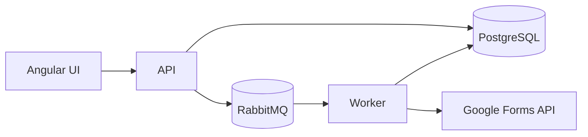

# Google Forms Provider Integration Plan

## Purpose

Deliver the first third-party Form provider integration for Survey Service by connecting Google Forms to the existing monorepo stack.

This plan covers the provider boundary from API request to worker processing:

- `packages/connectors/google` for Google-specific API client and auth helpers.
- `apps/api` for connection lifecycle, manual sync trigger, and job creation.
- `apps/worker` for queue consumption and Google sync execution.
- `packages/db` for provider connection metadata, sync cursors, and normalized form storage.
- `packages/contracts` for provider-facing DTOs and job payloads.

## Current State

### Implemented Foundation

1. API and worker job pipeline exists.
- The API can persist jobs and publish sync messages.
- The worker can consume sync messages and update job lifecycle state.

2. Shared contracts exist.
- Zod schemas and TypeScript types are already used across API and worker.

3. Connector package exists.
- `packages/connectors/google` and `packages/connectors/microsoft` directories are present as integration boundaries.

### Missing for Google

1. No concrete Google client implementation yet.
2. No Google auth/token lifecycle management.
3. No provider sync cursor model or normalized form ingestion path.
4. No provider-specific integration tests.

## Target Outcome

Google Forms should be the first provider that can:

1. Connect an external Google account to a Survey Service user.
2. Store provider credentials securely.
3. Sync form metadata and responses on demand.
4. Persist sync progress and expose it through the existing job lifecycle.
5. Serve as the template for Microsoft Forms later.

## Scope

### In Scope

- Google OAuth 2.0 Authorization Code flow with PKCE for provider access.
- Per-user Google account linking in the connector boundary.
- Google Forms client implementation in `packages/connectors/google`.
- Google-specific sync orchestration in the worker.
- DB schema updates for provider connections and sync cursors.
- API route wiring for connection setup and manual sync trigger.
- Shared contract updates for provider payloads and normalized form metadata.
- Test coverage for auth, sync, normalization, and error handling.

### Out of Scope

- Microsoft Forms integration.
- Dashboard analytics beyond normalized data ingestion.
- Complex sharing UX beyond current API contract.
- Full provider discovery UI polish.

## Provider Strategy

### Initial Provider Model

Start with a single provider implementation behind a stable connector interface.

Recommended boundary:

- `GoogleFormsConnector` handles Google-specific HTTP requests, pagination, and error mapping.
- A provider-agnostic service in the worker orchestrates fetch -> normalize -> persist.
- API handlers never call Google APIs directly.

### Auth Model Decision

Use Google OAuth 2.0 Authorization Code flow with PKCE.

Why this is the default:

- It matches current Google best practices for browser-initiated authorization.
- It supports per-user account linking cleanly.
- It avoids embedding client secrets in the Angular frontend.
- It fits the Survey Service model where each user connects their own Google account to their Survey Service account.

Decision criteria:

- Does the organization want user-level consent or centralized service credentials?
- Do we need access to private forms owned by individual users?
- Can the Google workspace be administered centrally?

Recommended default for an internal product:

- Use OAuth 2.0 Authorization Code with PKCE and per-user refresh token storage.
- Only consider service-account access if Google workspace policy blocks delegated user consent.

## Data Flow

1. User starts Google account linking from the UI.
2. API creates the authorization request and PKCE verifier/challenge state.
3. User authenticates and grants access to their own Google account.
4. Google returns an authorization code to the API callback.
5. API exchanges the code for user-scoped access and refresh tokens.
6. API stores provider connection metadata and credentials.
7. User triggers sync from the UI or API.
8. API creates a job and publishes a sync message.
9. Worker consumes the job.
10. Worker uses the Google connector to fetch form metadata and responses.
11. Worker normalizes data and persists it.
12. Worker updates job status to terminal state.

## Technical Workstreams

### 1. Connector Package Design

Goal: define a provider-neutral interface and the Google implementation boundary.

Deliverables:

- `packages/connectors/google`
- Shared connector types for auth, form metadata, response batches, and errors.
- Google HTTP client wrappers with consistent timeout/retry behavior.

Definition of done:

- Worker can call the Google connector without knowing Google-specific transport details.

### 2. Credential Lifecycle

Goal: securely store and refresh Google provider credentials.

Deliverables:

- DB schema for provider access tokens and refresh tokens.
- PKCE verifier/challenge handling for auth start/callback.
- Credential encryption or secret storage strategy.
- Token refresh helper in the connector layer.

Definition of done:

- Connector can refresh expired credentials without exposing secrets in logs or API responses.

### 3. Sync and Normalization

Goal: fetch Google form data and convert it into the app’s canonical model.

Deliverables:

- Fetch form metadata.
- Fetch response batches incrementally.
- Normalize provider payloads into `forms`, `responses`, and sync cursor records.

Definition of done:

- A sync job can ingest a known Google form end-to-end into the database.

### 4. API Surface

Goal: expose connection setup and sync trigger flows through the API.

Deliverables:

- Google auth start and callback routes for per-user account linking.
- Connection creation/update route behavior for Google provider.
- Manual sync endpoint support for provider-backed forms.
- Provider-specific validation and error mapping.

Definition of done:

- The frontend can connect Google and start a sync without knowing Google API details.

### 5. Worker Integration

Goal: connect queue processing to the Google connector.

Deliverables:

- Provider dispatch from sync jobs.
- Retry-safe processing.
- Status transitions for provider failures vs validation failures.

Definition of done:

- Google sync jobs can move from queued to running to succeeded/failed reliably.

## Phased Delivery Plan

### Phase 1: Contract and Boundary Setup

1. Define connector interfaces and provider payload DTOs in `packages/contracts` and `packages/connectors`.
2. Decide auth model and secret handling strategy.
3. Add DB schema for provider connection data and cursors.

Exit criteria:

- Google integration has a stable package/API boundary and a documented auth model.

### Phase 2: Google Client Implementation

1. Implement Google API client wrapper.
2. Implement PKCE auth start/callback flow and token refresh helpers.
3. Add unit tests for request shaping and error mapping.

Exit criteria:

- Google client can perform authenticated reads against a sandbox or mocked Google API.

### Phase 3: Sync Pipeline Wiring

1. Add worker logic to dispatch Google sync jobs.
2. Persist sync cursors and normalized records.
3. Map Google failures into terminal job states.

Exit criteria:

- A queued sync job can complete through the worker using the Google connector.

### Phase 4: API and UX Integration

1. Wire connection setup endpoints and form sync triggers to the Google provider.
2. Update frontend flows for Google account linking and connection status.
3. Keep API responses stable for job polling and connection status.

Exit criteria:

- A user can connect Google and trigger a sync end-to-end from the UI or API.

### Phase 5: Hardening and Expansion Readiness

1. Add integration tests for auth, refresh, sync, and terminal job states.
2. Document operational troubleshooting for provider failures.
3. Use the same pattern to prepare Microsoft Forms later.

Exit criteria:

- Google is production-shaped enough to serve as the template for Microsoft.

## Risks and Mitigations

1. OAuth scope mismatch or credential policy conflict
- Mitigation: decide auth model up front and document it in architecture and API docs.

2. Provider API rate limits
- Mitigation: use pagination, backoff, and incremental cursors.

3. Data model drift between provider payloads and canonical form schema
- Mitigation: normalize in one worker layer and cover with contract tests.

4. Secret leakage
- Mitigation: encrypt tokens at rest and redact logs.

5. Unclear discovery semantics
- Mitigation: start with known form IDs or a constrained discovery mechanism before broad search.

## Test Strategy

### Unit Tests

- Connector request formatting.
- PKCE helper behavior.
- Auth/token refresh helpers.
- Provider error mapping.
- Normalization helpers.

### Integration Tests

- Connect Google account flow.
- Sync a known Google form.
- Retry token refresh on expiry.
- Worker job transitions for provider success/failure.

### Contract Tests

- Provider DTO shapes.
- Job payload compatibility.
- API response envelope stability.

## Acceptance Criteria

1. Google is the first working provider connector in `packages/connectors`.
2. The API can create a provider-backed sync job for Google.
3. The worker can execute Google sync jobs and persist normalized results.
4. Credentials are stored and refreshed securely.
5. The implementation is documented well enough to serve as the template for Microsoft Forms.